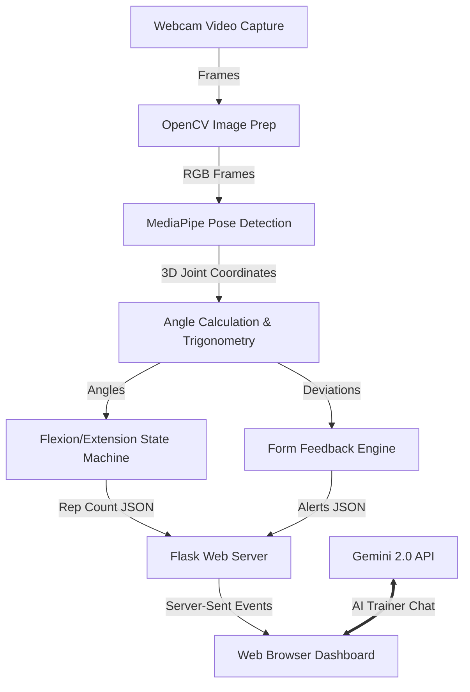

# Formova 🏋️‍♂️🤖

Welcome to **Formova**! I built this project during high school to combine two of my biggest passions: fitness and computer science. 

Formova is a real-time, AI-powered workout form analyzer and virtual personal trainer. Using computer vision, it tracks your body movements through a webcam, calculates your joint angles on the fly, counts your repetitions, warns you if your form is slipping, and even lets you chat with an AI personal trainer powered by Google's Gemini API!

I designed this project to explore how advanced computer vision and generative AI can be brought together into a simple, helpful web app. I'm hoping to continue building and expanding on these concepts as I head into college!

---

## 🌟 What It Does (Features)

*   **Real-Time Pose Tracking:** Uses Google's MediaPipe framework to detect 33 key landmarks on your body in real-time.
*   **Rep Counter & Form Analyzer:** Tracks 7 different exercises across upper body, legs, and cardio:
    *   *Arms & Shoulders:* Bicep Curls, Lateral Raises, Front Raises, Shoulder Press
    *   *Legs:* Squats, Lunges
    *   *Cardio/Core:* High Knees
*   **Form Correction Alerts:** The app monitors your range of motion and gives you on-screen feedback if you aren't completing the full rep (like *"Squat deeper!"* or *"Curl higher!"*).
*   **AI Fitness Coach:** An interactive chat window powered by Gemini to ask for workout plans, diet tips, or healthy food replacements.
*   **Web Dashboard:** A clean, single-page web interface built using Flask, HTML, and CSS.

---

## 📐 How It Works (Technical Overview)

Building this app taught me a lot about combining video processing pipelines with coordinate math. Here is a look under the hood at how the pipeline works:



### 🧠 The Math Behind the Camera (Trigonometry in Action)

To check if you are doing an exercise correctly, the app has to calculate the angle of specific joints (like your elbow during a bicep curl, or your knee during a squat). 

MediaPipe gives us the $x$ and $y$ coordinate points of each joint in the camera frame. To find the angle at a vertex joint (like the Elbow, point $B$), we use the coordinates of three points:
1.  **Start Joint ($A$):** e.g., Shoulder (Landmark 12)
2.  **Vertex Joint ($B$):** e.g., Elbow (Landmark 14)
3.  **End Joint ($C$):** e.g., Wrist (Landmark 16)

First, we represent the arm segments as two vectors originating from the elbow ($B$):
*   Vector $\vec{BA} = (x_a - x_b, y_a - y_b)$
*   Vector $\vec{BC} = (x_c - x_b, y_c - y_b)$

Using the **dot product** formula:
$$\vec{BA} \cdot \vec{BC} = \|\vec{BA}\| \|\vec{BC}\| \cos(\theta)$$

We solve for the angle $\theta$ in degrees:
$$\theta = \arccos\left( \frac{\vec{BA} \cdot \vec{BC}}{\|\vec{BA}\| \|\vec{BC}\|} \right) \times \frac{180}{\pi}$$

In Python, using `math.atan2` is much more robust against dividing by zero, so I implemented it like this in my `PoseModule.py`:
```python
angle = math.degrees(
    math.atan2(y3 - y2, x3 - x2) - math.atan2(y1 - y2, x1 - x2)
)
if angle < 0:
    angle += 360
```

### 🔄 The Repetition State Machine

One of the biggest challenges I faced was "jitter." If you just count a rep when an angle crosses a line, natural shaking or minor camera movement can trigger 10 reps in a single second!

To solve this, I designed a **two-phase state machine**:
1.  **Flexion Phase (Dir = 1):** You must contract the muscle fully past a high threshold (e.g., elbow angle $\leq 50^\circ$).
2.  **Extension Phase (Dir = 0):** You must return the arm to the starting position past a low threshold (e.g., elbow angle $\geq 170^\circ$).
3.  **Form Check:** If you reverse your arm movement in the middle of a rep (like starting to go back down when your elbow is only at $80^\circ$), the app detects that you didn't reach the target threshold and triggers an alert: *"Curl higher! Arm not fully flexed."*

---

## 📸 Screenshots & Demo

*(Placeholders: I'll be adding GIFs/Images here to show off the app on my GitHub profile!)*

| Real-Time Pose Tracking & Rep Counting | Gemini AI Trainer Assistant |
|:---:|:---:|
|  |  |
| *Screen showing my skeleton overlay, the dynamic progress bar, and active feedback.* | *Chatting with the Gemini AI about my protein goals.* |

---

## 🛠️ What I Learned & Challenges I Overcame

*   **Handling Multi-threading in Python:** Capturing video frames, processing them with MediaPipe, and hosting a Flask server simultaneously was lagging my system. I overcame this by moving the webcam frame-reading to a separate **background thread** using a thread-safe queue. This smoothed out the frame rate significantly!
*   **API Security:** Originally, I had my Gemini API key hardcoded in the script. I learned about environment variables and security, so I restructured the codebase to load keys dynamically using `python-dotenv` and created a `.env.example` file.
*   **Trigonometric Edge Cases:** I had to learn how to handle cases where your body faces sideways (profile view) vs. straight on, tweaking the angle thresholds so that squats and lateral raises remain accurate across different camera positions.

---

## 🔮 Future Roadmap (My Plans for College & Beyond!)

Now that I have a functional desktop version, I want to take this project to the next level in college:

1.  **Migrate to a React & Tailwind CSS Frontend:**
    *   Currently, the UI uses simple Flask templates. I want to rebuild it into a modern, responsive Single Page Application (SPA) using React and Tailwind CSS.
2.  **Transition to WebAssembly (Client-Side Inference):**
    *   Instead of sending video frames to Python to process, I plan to run MediaPipe in the browser using WebAssembly. This offloads the calculations to the user's browser, eliminating lag entirely!
3.  **Temporal Deep Learning Models (LSTMs):**
    *   Simple angle threshold math works for basic exercises, but complex movements like Deadlifts or Clean & Jerks are impossible to analyze frame-by-frame. I want to train a **Long Short-Term Memory (LSTM)** neural network on video sequences to track form dynamically over time.
4.  **Database Analytics:**
    *   Integrate a backend like Supabase/PostgreSQL to allow users to sign up, save their workouts, and see custom charts tracking their form consistency over months.

---

## 🚀 How to Set Up & Run Formova

### Prerequisites
*   Python 3.8 to 3.11 installed.
*   A webcam connected to your computer.

### 1. Clone this repository
```bash
git clone https://github.com/your-username/formova.git
cd formova
```

### 2. Set up a Virtual Environment
```bash
# Create the environment
python -m venv venv

# Activate it (Mac/Linux):
source venv/bin/activate

# Activate it (Windows):
venv\Scripts\activate
```

### 3. Install the dependencies
```bash
pip install -r requirements.txt
```

### 4. Configure your API Keys
Copy the example template file:
```bash
cp OpenCV_AIworkout/.env.example OpenCV_AIworkout/.env
```
Open `OpenCV_AIworkout/.env` in your text editor and add your keys:
```env
GOOGLE_API_KEY=your_actual_gemini_api_key_here
FLASK_SECRET_KEY=create_some_random_secret_password
```

### 5. Start the Web Server
```bash
cd OpenCV_AIworkout
python app.py
```
Open your browser and navigate to **`http://127.0.0.1:5000`**!

---

## 📄 License

Distributed under the **MIT License**.

```text
MIT License

Copyright (c) 2026 Mayank Narla

Permission is hereby granted, free of charge, to any person obtaining a copy
of this software and associated documentation files (the "Software"), to deal
in the Software without restriction, including without limitation the rights
to use, copy, modify, merge, publish, distribute, sublicense, and/or sell
copies of the Software, and to permit persons to whom the Software is
furnished to do so, subject to the following conditions:

The above copyright notice and this permission notice shall be included in all
copies or substantial portions of the Software.

THE SOFTWARE IS PROVIDED "AS IS", WITHOUT WARRANTY OF ANY KIND, EXPRESS OR
IMPLIED, INCLUDING BUT NOT LIMITED TO THE WARRANTIES OF MERCHANTABILITY,
FITNESS FOR A PARTICULAR PURPOSE AND NONINFRINGEMENT. IN NO EVENT SHALL THE
AUTHORS OR COPYRIGHT HOLDERS BE LIABLE FOR ANY CLAIM, DAMAGES OR OTHER
LIABILITY, WHETHER IN AN ACTION OF CONTRACT, TORT OR OTHERWISE, ARISING FROM,
OUT OF OR IN CONNECTION WITH THE SOFTWARE OR THE USE OR OTHER DEALINGS IN THE
SOFTWARE.
```
