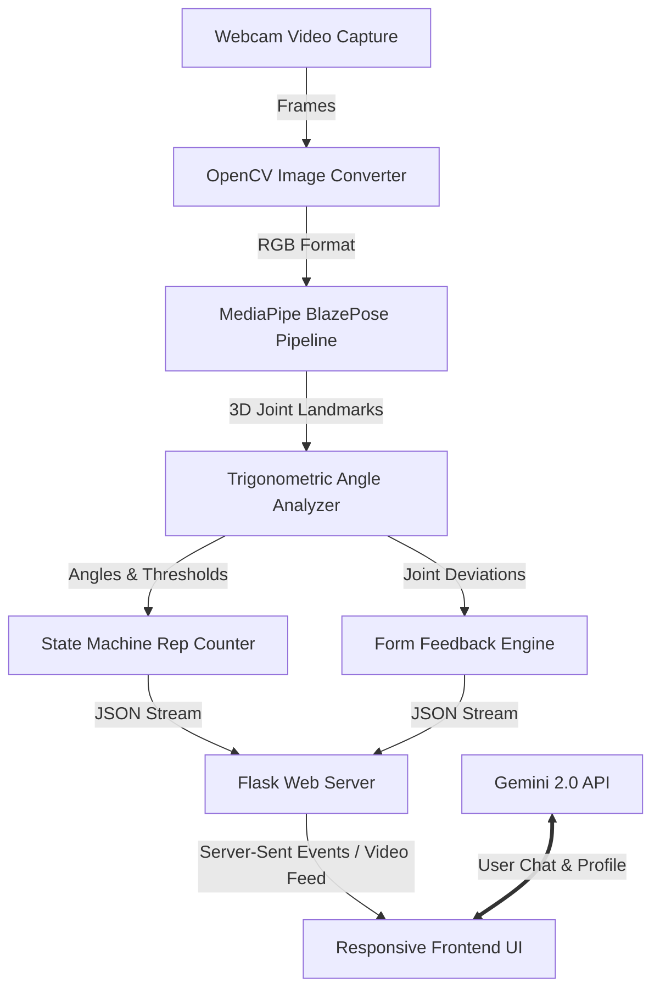

# Formova 🏋️‍♂️🤖

[](https://www.python.org/)
[](https://flask.palletsprojects.com/)
[](https://opencv.org/)
[](https://google.github.io/mediapipe/solutions/pose.html)
[](https://opensource.org/licenses/MIT)

**Formova** is an intelligent, real-time AI workout form analyzer and virtual personal trainer. Utilizing state-of-the-art computer vision models, it acts as a digital mirror that tracks physical movements, calculates joint angles dynamically, counts repetitions, alerts users to improper form, and offers a personalized AI training chatbot powered by the Google Gemini API.

Designed as a college portfolio piece, Formova bridges the gap between raw hardware vision processing, real-time web UI feedback, and generative AI to revolutionize the digital fitness experience.

---

## 🌟 Key Features

*   **Real-Time 3D Pose Tracking:** Captures 33 distinct skeletal landmarks with high spatial accuracy using the MediaPipe BlazePose pipeline.
*   **Dynamic Repetition & Form Analysis:** Trackers for 7 different multi-joint exercises:
    *   *Upper Body:* Bicep Curls, Lateral Raises, Front Raises, Shoulder Press
    *   *Lower Body & Legs:* Squats, Lunges
    *   *Cardiovascular/Core:* High Knees
*   **Adaptive Form Correction Feedback:** Instant visual alerts on screen (e.g., *"Squat deeper! Not low enough"*, *"Curl higher! Arm not fully flexed"*) to prevent injuries and optimize muscle activation.
*   **Personalized AI Fitness Chatbot:** Integrated assistant powered by Google Gemini, helping users curate workout schedules, customize diet preferences, and ask specific physiological questions right from the panel.
*   **Responsive Dashboard Interface:** Modern, single-page dashboard featuring responsive camera overlays, state-of-the-art progress bars, and real-time statistics.

---

## ⚙️ Technical Overview

Formova employs a multi-stage pipeline combining frame-by-frame computer vision and coordinate geometry.



### 📐 The Mathematics of Pose Estimation

For any joint of interest (e.g., the elbow during a curl, or the knee during a squat), we isolate three sequential landmarks:
1.  **Start Joint ($A$):** e.g., Shoulder (Landmark 12)
2.  **Vertex Joint ($B$):** e.g., Elbow (Landmark 14)
3.  **End Joint ($C$):** e.g., Wrist (Landmark 16)

Given the coordinate vectors of these landmarks in 2D/3D space:
*   $\vec{BA} = (x_a - x_b, y_a - y_b)$
*   $\vec{BC} = (x_c - x_b, y_c - y_b)$

Using the **dot product** definition:
$$\vec{BA} \cdot \vec{BC} = \|\vec{BA}\| \|\vec{BC}\| \cos(\theta)$$

We solve for the angle $\theta$ (in degrees):
$$\theta = \arccos\left( \frac{\vec{BA} \cdot \vec{BC}}{\|\vec{BA}\| \|\vec{BC}\|} \right) \times \frac{180}{\pi}$$

In the source code, this is calculated efficiently using vector trigonometry:
```python
angle = math.degrees(
    math.atan2(y3 - y2, x3 - x2) - math.atan2(y1 - y2, x1 - x2)
)
if angle < 0:
    angle += 360
```

### 🤖 Repetition State Machine

Rather than incrementing reps on static threshold crossings, which are highly susceptible to camera jitter, Formova implements a **two-phase state machine**:
*   **Flexion Phase (Dir = 1):** Landmark angle crosses the minimum threshold (e.g., Bicep Curl angle $\leq 50^\circ$), signaling a fully contracted joint.
*   **Extension Phase (Dir = 0):** Landmark angle returns past the maximum threshold (e.g., Bicep Curl angle $\geq 170^\circ$), completing the full range of motion.
*   **Form Validation:** If the user reverses movement before hitting the optimal range (e.g., reversing a curl at $80^\circ$ instead of $50^\circ$), the feedback engine triggers an alert: *"Curl higher! Arm not fully flexed."*

---

## 📸 Visuals & Demonstration

*(Placeholders: Add your high-quality GIFs/Screenshots here to make your portfolio shine!)*

| Live Camera View & Analytics | AI Workout Assistant |
|:---:|:---:|
|  |  |
| *Real-time skeleton tracking, progress gauge, and instant feedback overlay.* | *The Gemini AI trainer generating a customized meal prep guide.* |

---

## 🔮 Future Roadmap & Portfolio Expansion

To demonstrate college-level software engineering growth, the following features are actively planned for Formova:

1.  **Transition to Modern Single Page Application (SPA):**
    *   Migrate the frontend from basic Flask HTML templates to **React.js (Vite)** with **Tailwind CSS** or **Framer Motion** for premium transitions.
    *   Decouple frontend and backend into a microservices architecture.
2.  **Sequence-Based Machine Learning (Temporal Form Tracking):**
    *   Move beyond static frame-by-frame angle math to sequence-based deep learning.
    *   Train a **Long Short-Term Memory (LSTM)** network or **Graph Convolutional Network (GCN)** on continuous video frame sequences to evaluate complex compound lifts (e.g., Deadlift back rounding, Bench Press path deviation).
3.  **Low Latency Edge-Inference:**
    *   Implement **MediaPipe Task Vision (Web Assembly)** directly in the browser. This offloads model inference to the client's GPU, reducing network overhead to zero and scaling the app seamlessly to mobile browsers.
4.  **Database Integration & Workout Analytics:**
    *   Integrate **Supabase / PostgreSQL** to manage user authentication, save historical workout performance, and display progress analytics dashboards (charts showing rep consistency, form accuracy over time).

---

## 🚀 Installation & Setup

### Prerequisites
*   Python 3.8 to 3.11
*   A functional webcam

### 1. Clone the Workspace
```bash
git clone https://github.com/your-username/formova.git
cd formova
```

### 2. Configure Virtual Environment
```bash
# Create virtual environment
python -m venv venv

# Activate on macOS/Linux:
source venv/bin/activate

# Activate on Windows:
venv\Scripts\activate
```

### 3. Install Dependencies
```bash
pip install -r requirements.txt
```

### 4. Set Up Environment Variables
Copy the template environment file and insert your API credentials:
```bash
cp OpenCV_AIworkout/.env.example OpenCV_AIworkout/.env
```
Open `OpenCV_AIworkout/.env` and update:
```env
GOOGLE_API_KEY=your_gemini_api_key_here
FLASK_SECRET_KEY=generate_a_random_key_here
```

### 5. Launch the Application
```bash
cd OpenCV_AIworkout
python app.py
```
Open your web browser and navigate to **`http://127.0.0.1:5000`**.

---

## 📄 License

Distributed under the **MIT License**. See [LICENSE](LICENSE) for more details.

```text
MIT License

Copyright (c) 2026 Mayank Narla

Permission is hereby granted, free of charge, to any person obtaining a copy
of this software and associated documentation files (the "Software"), to deal
in the Software without restriction, including without limitation the rights
to use, copy, modify, merge, publish, distribute, sublicense, and/or sell
copies of the Software, and to permit persons to whom the Software is
furnished to do so, subject to the following conditions:

The above copyright notice and this permission notice shall be included in all
copies or substantial portions of the Software.

THE SOFTWARE IS PROVIDED "AS IS", WITHOUT WARRANTY OF ANY KIND, EXPRESS OR
IMPLIED, INCLUDING BUT NOT LIMITED TO THE WARRANTIES OF MERCHANTABILITY,
FITNESS FOR A PARTICULAR PURPOSE AND NONINFRINGEMENT. IN NO EVENT SHALL THE
AUTHORS OR COPYRIGHT HOLDERS BE LIABLE FOR ANY CLAIM, DAMAGES OR OTHER
LIABILITY, WHETHER IN AN ACTION OF CONTRACT, TORT OR OTHERWISE, ARISING FROM,
OUT OF OR IN CONNECTION WITH THE SOFTWARE OR THE USE OR OTHER DEALINGS IN THE
SOFTWARE.
```
